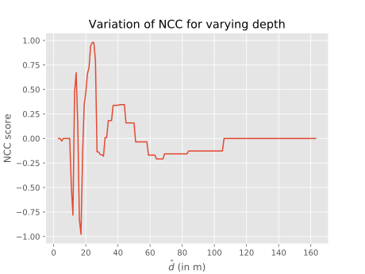

# Depth Filter [WIP]
Given the egomotion, this framework estimates depth of sparse points using sequential Bayesian updates

## TODO
- [x] Analysis of variation of depth along unit bearing vector in multiple views
- [ ] Large scale statistics separtely for forward-case large depths, short range, downward facing

## Progress

- Variation of Normalized Cross Correlation score as depth is varied

